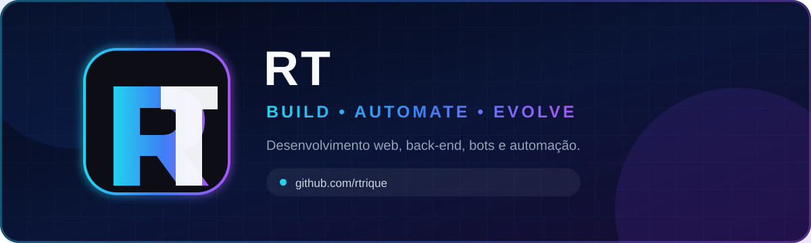
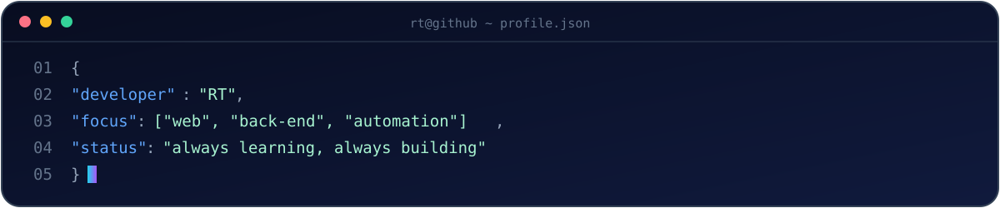
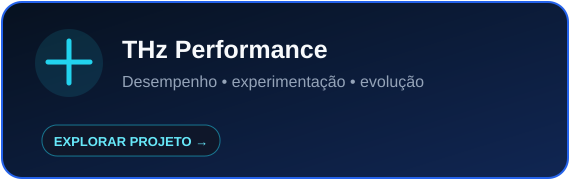
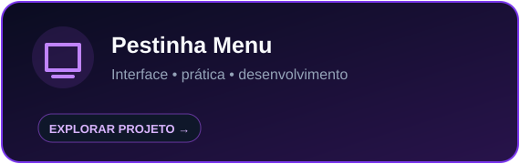
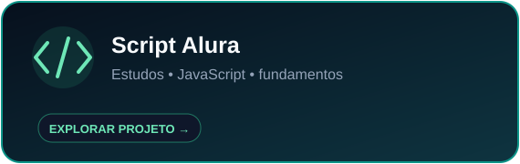
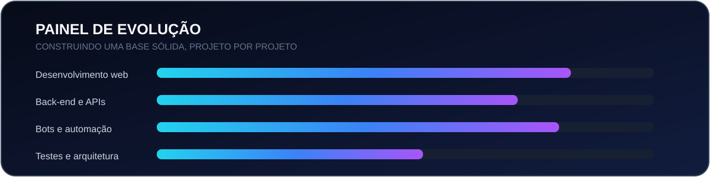
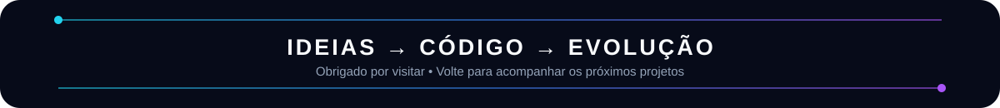

 

## ⚡ Sobre mim

Sou o **RT**, desenvolvedor brasileiro em constante evolução. Gosto de aprender construindo, transformar ideias em projetos reais e melhorar cada entrega — do código à documentação.

- 🔭 Desenvolvendo projetos web, back-end, bots e automações
- 🌱 Evoluindo arquitetura, qualidade de código e boas práticas
- 🧠 Aprendizado contínuo por meio de projetos práticos
- 🎯 Objetivo: criar soluções úteis, rápidas e bem apresentadas

## 🧰 Tecnologias e ferramentas

### Linguagens

### Ambiente e ferramentas

## 🚀 Projetos em destaque

## 📊 Evolução no GitHub

## 🧭 Roadmap

> Este perfil está em evolução contínua. Cada projeto novo representa uma habilidade praticada, um problema resolvido e mais um passo na jornada.

### Vamos construir algo interessante?

